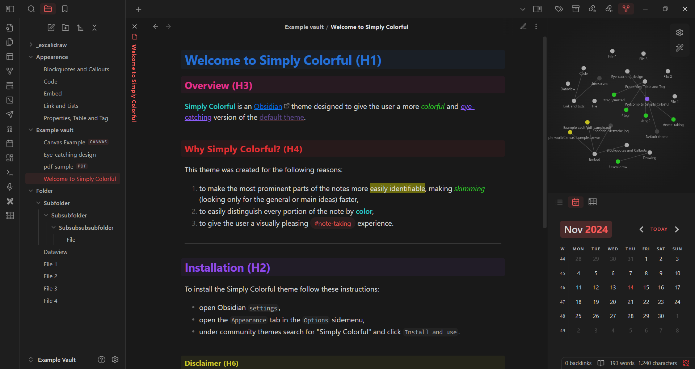
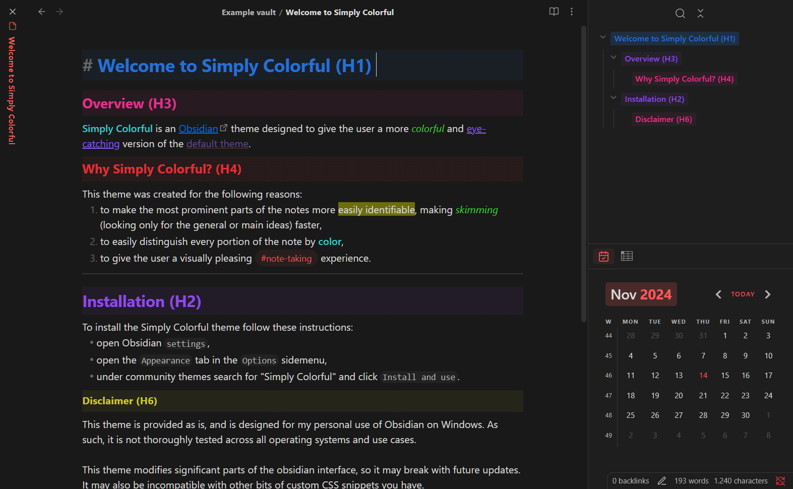
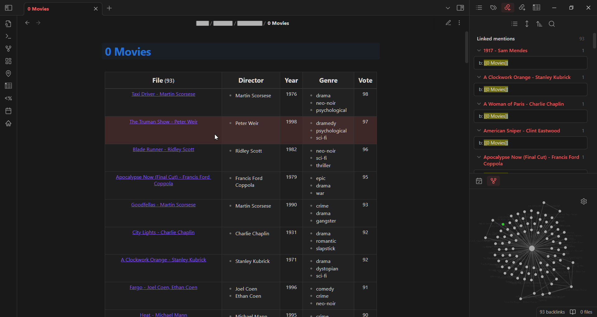
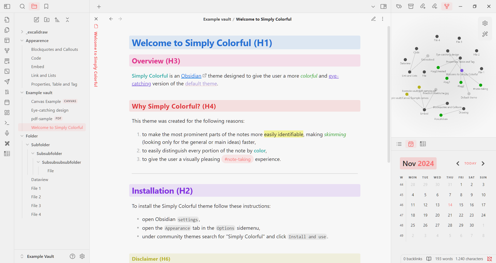
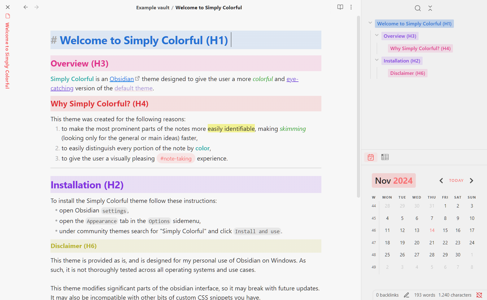
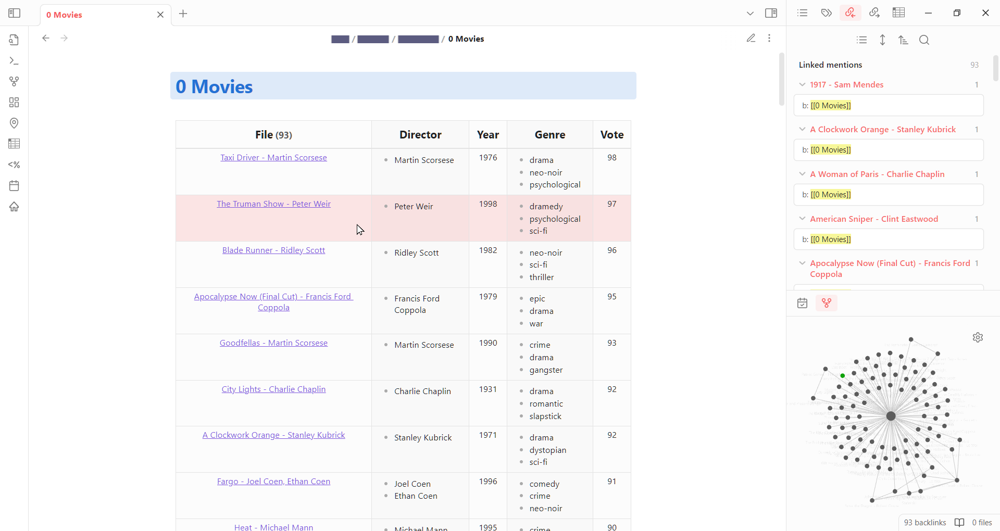

	

**Simply Colorful** is an [Obsidian](https://obsidian.md/) theme for desktop created by [LorenzoPegorari](https://github.com/LorenzoPegorari).

This theme was created for the following reasons:
1. to make the most prominent parts of the notes pop out more, making *skimming* faster
2. to quickly distinguish every portion of the notes (different headings, internal links, external links, etc.)
3. to give the user a visually pleasing note-taking experience by making a strong use of the chosen personalized *accent color*
## Index
- [Images](#images)
	- [Dark theme](#dark-theme)
	- [Light theme](#light-theme)
- [Features](#features)
- [Installation](#installation)
	- [Directly from Obsidian](#directly-from-obsidian)
	- [Alternate method](#alternate-method)
- [Feedback](#feedback)
- [Credits](#credits)
- [License](#license)
- [Disclaimer](#disclaimer)
# Images
_Accent color used in examples_:
- **RGB** = 245, 92, 92
- **HSL** = 0, 88%, 66%
- **HEX** = #F55C5C
## Dark theme
### Note example:

### Live preview and note outline example:

### Dataview table example:

## Light theme
### Note example:

### Live preview and note outline example:

### Dataview table example:

# Features
- Support for both light and dark mode
- Support for all window frame style (hidden, Obsidian frame, native frame)
- Support for both stacked tabs and sliding panes
- Colorful headings in both *Live Preview mode* and *Reading mode* (with a sweet animation while in *Reading mode*)
- Support for core plugins
- Support for popular community plugins (Excalidraw, Dataview, Calendar, Advanced Tables, etc.)
- Support for [Style Settings plugin](https://github.com/mgmeyers/obsidian-style-settings)
# Installation
## Directly from Obsidian
This theme was reviewed by the [Obsidian team](https://github.com/obsidianmd), and was inserted in the [official list of themes](https://github.com/obsidianmd/obsidian-releases/blob/master/community-css-themes.json) after approval on [pull request #4403](https://github.com/obsidianmd/obsidian-releases/pull/4403).

This means that it can be easily installed by following the instruction below:
- open Obsidian `Settings`,
- open the `Appearance` tab in the `Options` sidemenu,
- click `Manage` next to `Themes`,
- search for "**Simply Colorful**" and click `Install and use`.
## Alternate method
Otherwise it can be installed by following the instruction below:
- open Obsidian `Settings`,
- open the `Appearance` tab in the `Options` sidemenu,
- click the *folder icon* next to `Themes`,
- create in the opened folder a new folder called "**Simply Colorful**",
- go in the [GitHub Releases page](https://github.com/LorenzoPegorari/SimplyColorful/releases/latest) and download from the latest release the `theme.css` and `manifest.json` files,
- put these 2 files in the created "**Simply Colorful**" folder,
- reload Obsidian,
- open Obsidian `Settings`,
- open the `Appearance` tab in the `Options` sidemenu,
- select "**Simply Colorful**" in the *drop-down menu* next to `Themes`.
# Feedback
If you encounter any issues or have any suggestions, feel free to contact me on the [Obsidian discord](https://discord.com/invite/obsidianmd) (@UberLias) or on the [main discussion in the Obsidian forum](https://forum.obsidian.md/t/theme-simply-colorful/89992).

You can also [submit an issue](https://github.com/LorenzoPegorari/SimplyColorful/issues) or raise a [pull request](https://github.com/LorenzoPegorari/SimplyColorful/pulls) if you want.
# Credits
A **big** thanks to [@kepano](https://github.com/kepano)'s [Minimal Theme](https://github.com/kepano/obsidian-minimal), that I used as a reference for this theme.

Please support @kepano on [X](https://x.com/kepano) or [buy @kepano a coffee](https://www.buymeacoffee.com/kepano).
# License
This theme is licensed under the [MIT License](LICENSE).
# Disclaimer
This theme is provided as is, and is designed for my personal use of Obsidian on Windows 10 and Windows 11. As such, it is not thoroughly tested across all operating systems and use cases.

This theme modifies some parts of the obsidian interface, so it may break with future updates. It may also be incompatible with other bits of custom CSS snippets you have.
